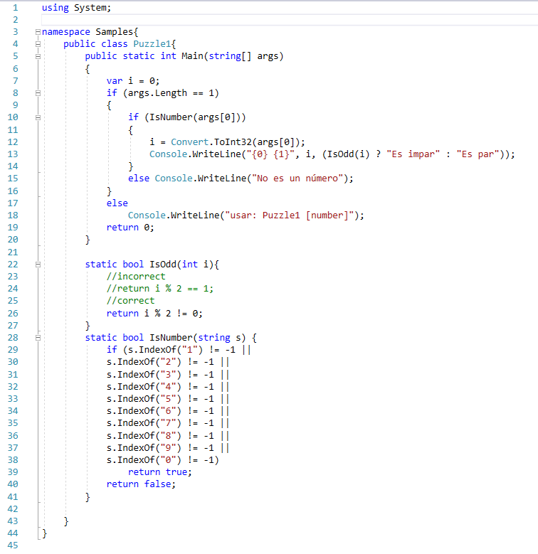
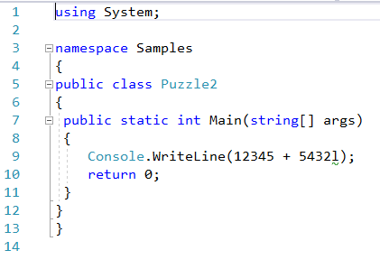
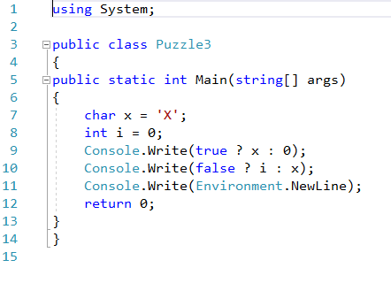
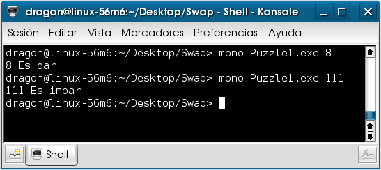
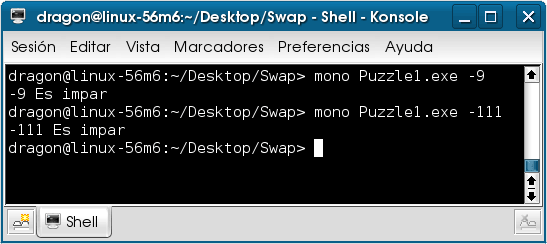
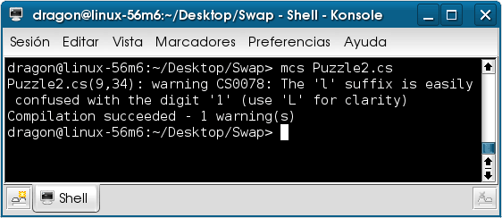
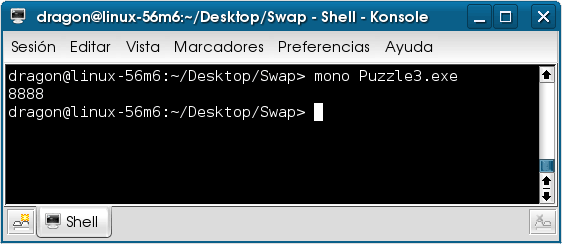
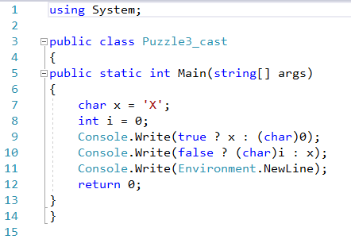
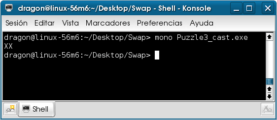

# Conversiones y curiosidades acerca de C#

En el libro Java Puzzlers: Traps, Pitfalls, and Corner Cases de Joshua Bloch y Neal Gafter publicado por Addison Wesley Professional en el año 2005 encontré ciertas curiosidades y trucos acerca de la programación en Java que me llamaron la atención, los autores explican la razón de tales escollos por lo que tome algunos ejemplos del libro para programarlos con C# y ver si obtendría los mismos resultados que sus contrapartes en Java.

Aquí algunos ejemplos del libro con las mismas preguntas, la diferencia únicamente es la implementación de Java a C#.

1-. En el siguiente programa ¿Es en todos los casos seguro que el método IsOdd determine correctamente si el número entero es par o no?

2-.¿Qué valor imprime el siguiente programa?

3-. ¿Cuál es el resultado del siguiente programa?

Analicemos cada uno de los ejemplos.

<h3>Ejemplo 1</h3>

Observaciones Al ejecutar el programa y pasarle un número entero como argumento desde la línea de comandos al parecer el programa determina si ese número es par o no, como en las siguientes imagen.

Pero el método que determina si el número es par o impar falla al pasarle un número negativo par o impar, esto siendo que toma como parámetro un entero y la mitad de los valores del tipo entero son negativos, el método supone que los residuos son únicamente positivos siendo que cuando la operación del residuo regresa un número que no es cero conserva el signo del dividendo.

La solución entonces es cambiar el método para que la comparación en vez de quedar igual a uno cambie a diferente a cero

<pre>
static bool IsOdd(int i)
{
    return i % 2 != 0;
}
</pre>

La siguiente imagen nos muestra el resultado:

<h3>Ejemplo 2</H3>

Observaciones Este ejemplo se refiere a una mala práctica de programación, si examinamos el código puede que no nos percatemos que el último digito del segundo sumando en lugar de ser el número uno (1) es la letra l (ele) minúscula, por lo que una de las buenas prácticas de programación señaladas en el libro es no utilizar la letra l (ele) minúscula para indicar un valor numérico de tipo long o como variable.

<pre>
Console.WriteLine(12345 + 5432l);
</pre>

En todo caso el compilador de C# nos lanza la advertencia al compilar el programa,

<pre>
Puzzle2.cs(9,34): warning CS0078: The 'l' suffix is easily 
confused with the digit '1' (use 'L' for clarity)
Compilation succeeded - 1 warning(s)
</pre>

que nos recomienda usar siempre la letra mayúscula para evitar confusiones, como se muestra en la siguiente imagen.

<h3>Ejemplo 3</H3>

Observaciones si examinamos el código del programa, al ejecutarlo debería de imprimir XX o sea dos veces el carácter ‘X’, un carácter por cada expresión por expresión, sin embargo al ejecutar el programa imprime 8888 como en la siguiente imagen:

Esto se debe a ciertas reglas del operador ternario u operador condicional (condicional operator) donde el primer operando debe ser de tipo bool que se cumple en el caso de ambas expresiones, la diferencia está en el segundo y tercer operador donde las reglas son:

<ul>
<li>Si los dos operadores son del mismo tipo la expresión devuelve ese tipo.</li>
<li>Si hay una conversión implícita del segundo al tercero pero no del tercero al segundo entonces la expresión devuelve el tipo del tercer operador.</li>
<li>Si hay una conversión implícita del tercero al segundo pero no del segundo al tercero entonces la expresión devuelve el tipo del segundo operador.</li>
</ul>

En el ejemplo 3 en la primera expresión existe la conversión implícita de char a int por lo que valor de la expresión es de tipo int y a imprimir es de tipo carácter se cumple la primera regla y en la segunda expresión no existe conversión implícita de int a char por lo se cumple la tercera regla.

En ambos casos es el equivalente de

<pre>
Console.Write((int)x);
</pre>

Para eliminar la confusión cambiemos el código a una conversión explicita:

El resultado es el esperado como se muestra en la siguiente imagen:

